# 第 8 章 飞书办公实战：从接入到交付

群聊里的反馈、知识库中的工作记录、日历上的安排和多维表格中的数据，构成了日常办公的上下文。接入飞书连接器后，WorkBuddy 可以读取这些信息，继续创建文档、预约会议、发送通知，并结合电脑上的工具制作 PPT。

本章先介绍飞书连接器的 5 步接入流程，再分享我实际使用过的 8 个办公场景。可以先从群聊总结开始，逐步尝试知识整理和多工具协作。示例中的群名、资料名称和日期来自当时的实践，使用时请替换为自己的任务信息。

## 8.1 接入飞书连接器

本章从 WorkBuddy 对话中调用飞书能力。如果希望在飞书聊天窗口里向 WorkBuddy 发任务，可以阅读下一章的小程序与 IM 助理接入方法。

### 第一步：打开连接器

打开 WorkBuddy，在左侧列表中找到「专家·技能·连接器」，入口如图 8-1 所示。

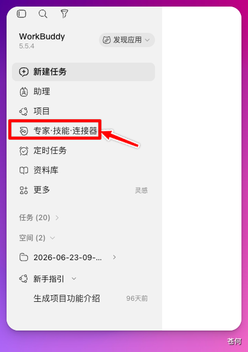

图 8-1 连接器入口

### 第二步：找到飞书连接器

在连接器中找到「飞书」，点击右上角的「+」，如图 8-2 所示。

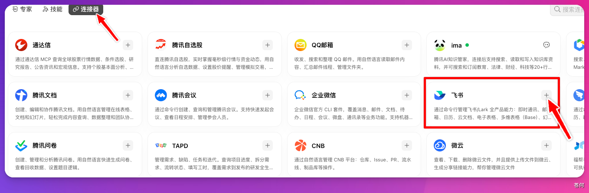

图 8-2 添加飞书连接器

### 第三步：创建飞书应用

页面会跳转到飞书开放平台，按照页面提示输入应用名称，然后点击「创建」，如图 8-3 所示。

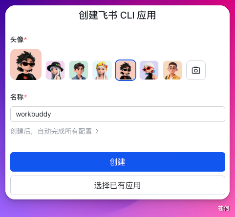

图 8-3 创建飞书应用

### 第四步：开通并授权

点击「开通并授权」，按照页面提示完成授权，如图 8-4 所示。

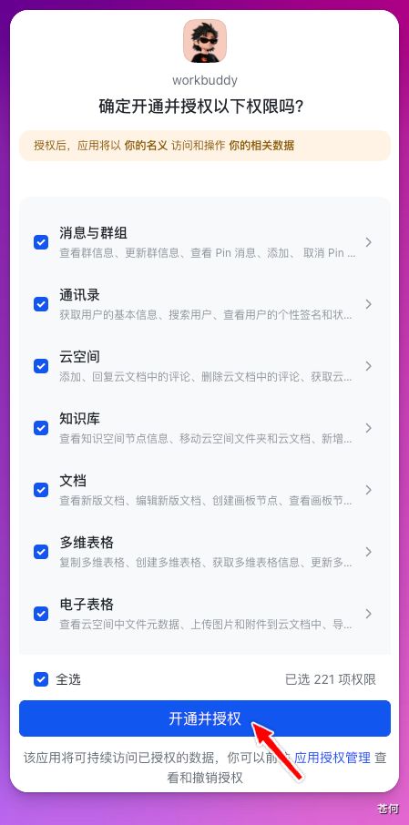

图 8-4 开通并授权应用

WorkBuddy 可访问的资源和可执行的操作，受到当前账号权限、应用授权范围及企业管理员设置的共同影响。

### 第五步：在对话中启用连接器

回到 WorkBuddy 对话框，点击左下角的「+」，找到连接器，打开飞书右侧的开关，如图 8-5 所示。

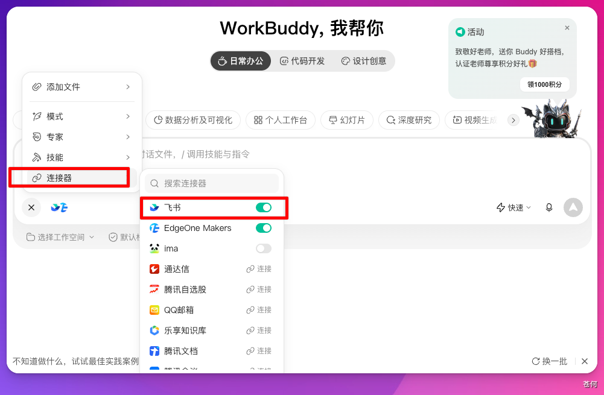

图 8-5 启用飞书连接器

完成后，可以在用于测试的群里发出一条通知。下面是我使用的指令，执行前先确认群名和通知内容：

```text
在飞书群【产品周会】里用机器人发一条通知，明天 15:00 在 3 楼会议室开周会，请带上周的进展材料。
```

在目标群中收到消息，说明这条消息发送链路已跑通。我的测试结果如图 8-6 所示，其他资源的读取与写入仍需具备对应权限。


图 8-6 群内收到测试通知

## 8.2 八个办公场景速查

可以按手头任务选择下面的场景，所需输入与交付物见表 8-1。

表 8-1 飞书办公场景速查

| 场景 | 主要输入 | 交付物 |
| --- | --- | --- |
| 群聊总结 | 群名、时间范围 | 重点消息 HTML 报告 |
| 知识库周报 | 每日工作记录 | 周报、飞书文档与群卡片 |
| 外部群通知 | 目标群、通知内容 | 机器人发送的群消息 |
| 会议预约 | 群聊、日程、参会范围 | 腾讯会议及飞书群通知 |
| 投放复盘 | 飞书多维表格 | 图表、异常分析与本地 PPT |
| 新人培训 | 运营手册知识库 | 7 天学习路径文档 |
| GEO 整改 | 品牌信息、诊断技能 | 报告、整改任务表与检查日程 |
| 热点运营 | 热点技能、内容数据表 | 选题库、复盘 PPT 与群通知 |

## 8.3 几百条群消息，一句话总结重点

我最常用的第一个场景，就是汇总群聊重点消息。我经常会加入大量用户反馈群，一天没看，未读消息就可能堆到几百条。这时，我直接把群名和时间范围交给 WorkBuddy。

```text
读取下 ZCode 用户反馈群 III 官方最近一周的重点消息。
```

在这次实践中，它读取群聊后，把重点内容整理成了 HTML 文件。官方发了什么、用户在聊什么、反馈走向如何，都可以集中查看，效果如图 8-7 所示。

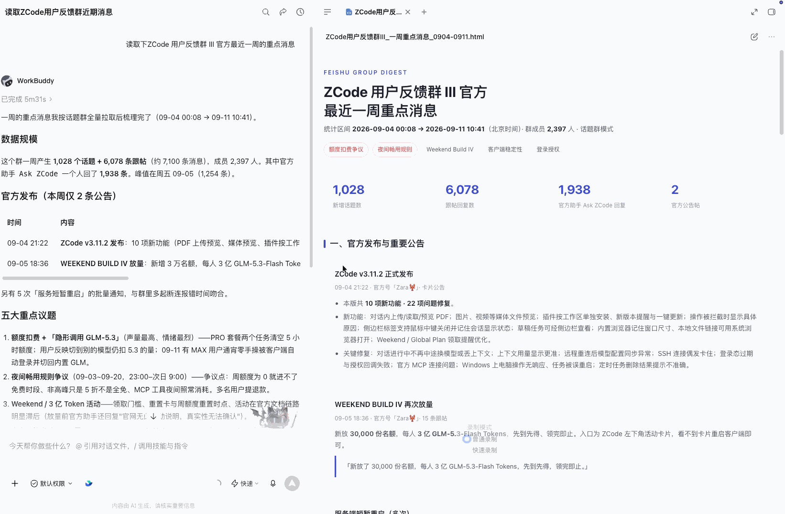

图 8-7 群聊重点消息报告

## 8.4 读完飞书知识库，自动生成周报

我会让 WeSight 把每天的工作自动沉淀到飞书知识库，但日报积累多了以后，重新翻阅本身又成了一项工作。所以我直接让 WorkBuddy 读取每日沉淀，整理本周主线、完成事项和可复用经验。

```text
总结一下飞书知识库【每日知识沉淀】里的文档，看一下我这周使用 AI 做了什么。请按本周主线任务、完成事项和可复用经验三个部分输出。
```

生成的周报如图 8-8 所示。

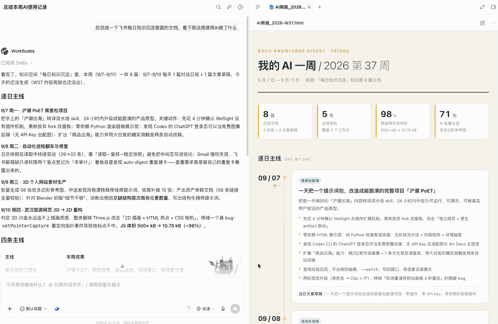

图 8-8 从知识库生成周报

周报生成后，还可以让它继续发送到协作群：

```text
把这个周报发到【产品运营协作群】，用卡片形式呈现，并附上完整周报链接。
```

完整周报被整理为飞书文档，如图 8-9 所示。

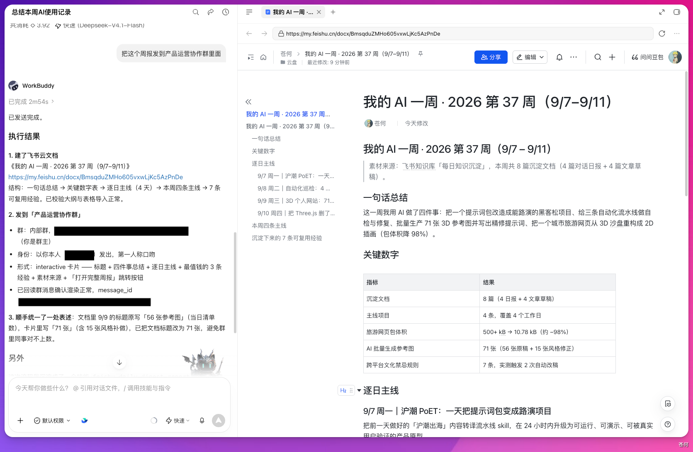

图 8-9 保存完整周报

WorkBuddy 会找到对应群聊，再把周报卡片发出去，结果如图 8-10 所示。

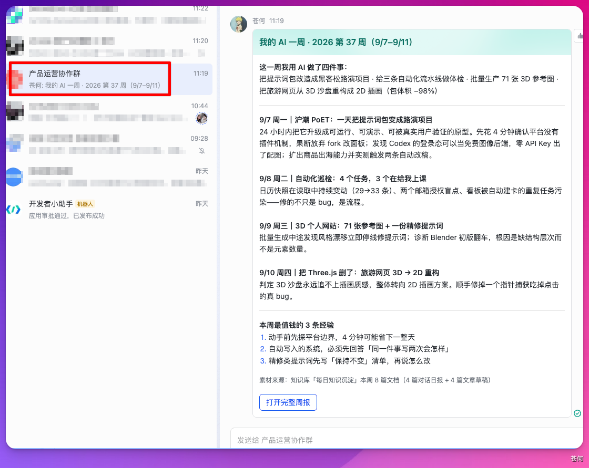

图 8-10 向协作群发送周报卡片

本次实践中，内部群消息可使用本人身份发送，外部群通知通过机器人身份发送。实际发送身份与可用能力，以当前连接器的授权方式和企业配置为准。

## 8.5 让机器人去外部群发通知

合作方、供应商和外部顾问经常都在一个外部群里。如果想让机器人代发通知，需要先开通外部群能力。

```text
在飞书群【供应商对账群】里用机器人发一条通知，9 月对账单已上传到群文件，请各供应商在周五 18:00 前完成核对，并把盖章确认页拍照发回群里。
```

在 WorkBuddy 中提交任务，如图 8-11 所示。

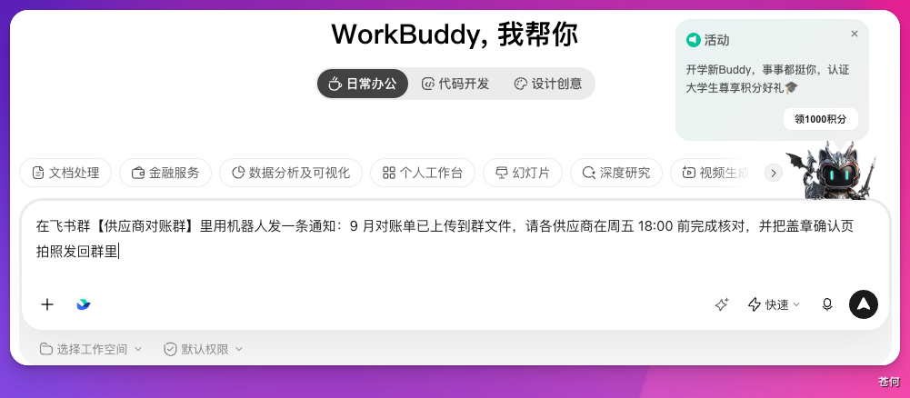

图 8-11 外部群通知任务

目标群如果是外部群，可能遇到机器人尚未入群或外部群能力未开通的提示。我的首次尝试如图 8-12 所示。

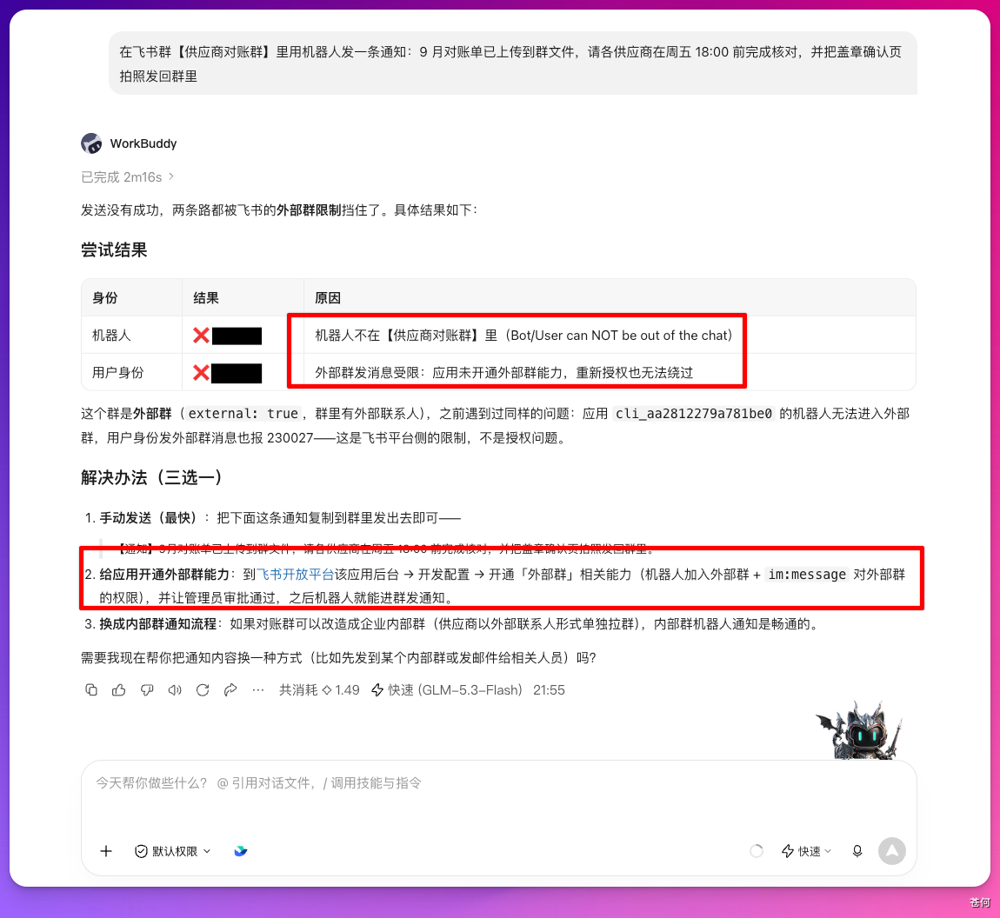

图 8-12 检查外部群配置

打开对应机器人的应用后台，点击「创建版本」，如图 8-13 所示。

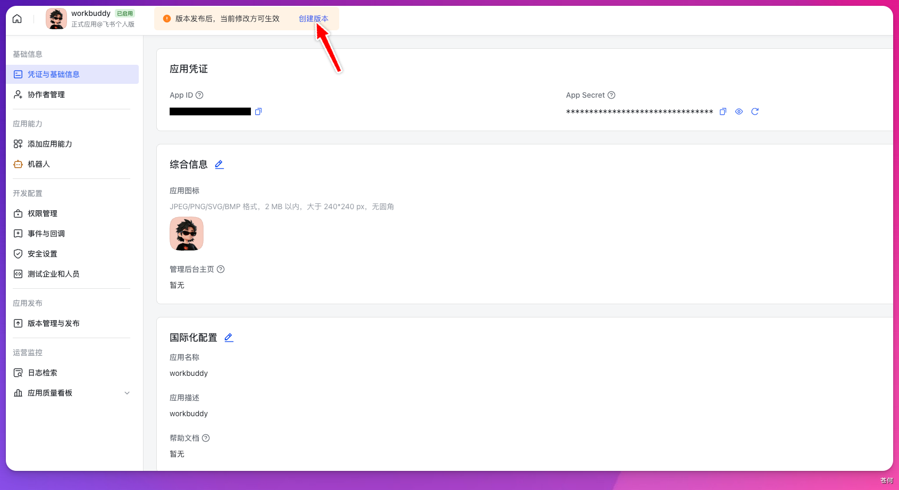

图 8-13 创建应用版本

找到「对外共享」，勾选「允许机器人被添加到外部群中使用」，保存并按照飞书页面提示完成版本发布，如图 8-14 所示。截图中同时展示了外部用户单聊选项，群通知场景需要的是外部群能力。

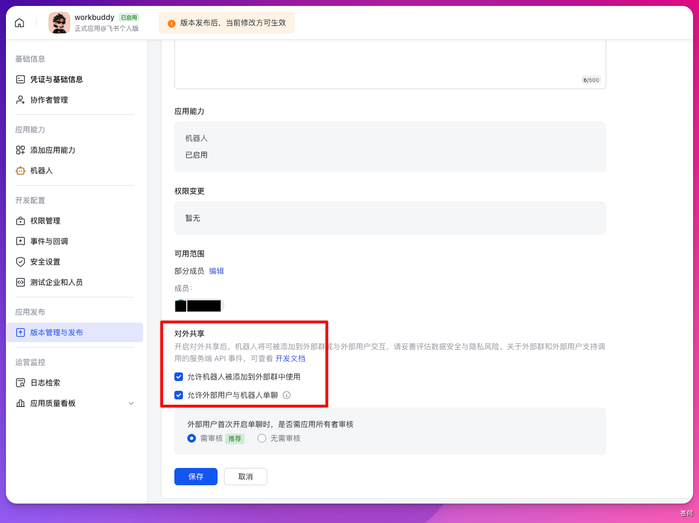

图 8-14 开通外部群能力

完成配置后，告诉 WorkBuddy 配置已经完成。在本次实践中，它使用我的身份邀请机器人入群，再以机器人身份发送通知，执行结果如图 8-15 所示。该流程需要当前账号有相应的邀请权限。

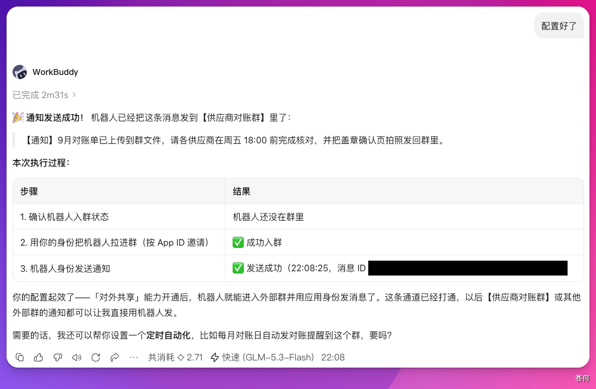

图 8-15 外部群通知执行结果

随后可以在对应群聊中看到通知，如图 8-16 所示。

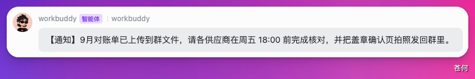

图 8-16 外部群收到通知

## 8.6 读取群聊和日程，自动预约会议

约团队会议最麻烦的，往往是找一个大家都有空的时间，再创建会议、发送链接和通知成员。WorkBuddy 可以结合群聊和飞书日历，筛选合适时段，再创建会议并发群通知。

下面是我使用的任务指令，其中包含自动选定时间和发送通知的授权。复用时，请根据自己的安排调整日期、参会范围以及是否需要先确认时间。

```text
请帮我协调并预约一次 WeSight 产品交流群的产品讨论会议。

1. 查看「WeSight产品交流群」近期聊天记录，找出成员提到过的空闲时间；
2. 结合飞书日历，检查核心成员在 2026-09-14 至 2026-09-16 的日程；
3. 选出大多数人都空闲的 1 小时时段，优先工作日下午，无需再向我确认；
4. 在腾讯会议创建主题为「WeSight 产品讨论会」的会议；
5. 将会议时间和链接发送到「WeSight产品交流群」；
6. 完成后向我汇报最终会议时间和群通知内容。
```

发送需求后，WorkBuddy 会读取可访问的群聊和飞书日程，识别成员的空闲时段，如图 8-17 所示。

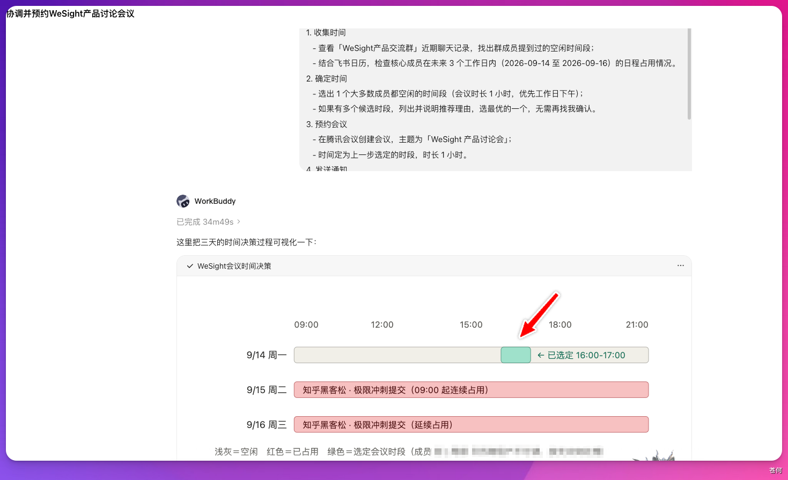

图 8-17 选择会议时段

如果还没有接入腾讯会议，它会提示通过授权链接连接相应的腾讯会议 CLI 能力。授权页面如图 8-18 所示。

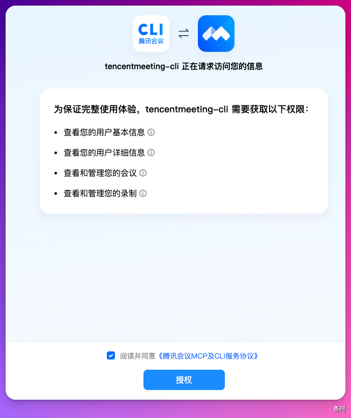

图 8-18 授权腾讯会议能力

完成后，WorkBuddy 会汇报会议时间和链接，如图 8-19 所示。

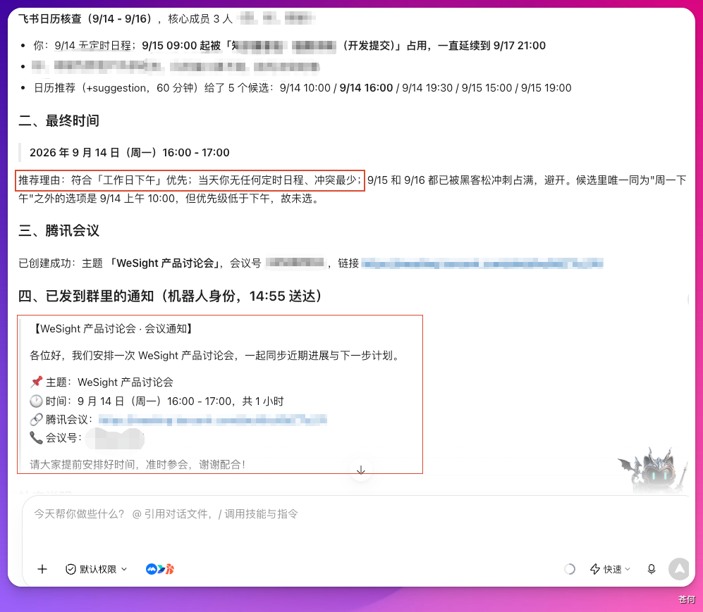

图 8-19 会议预约结果

打开飞书，就能看到对应的会议通知，如图 8-20 所示。

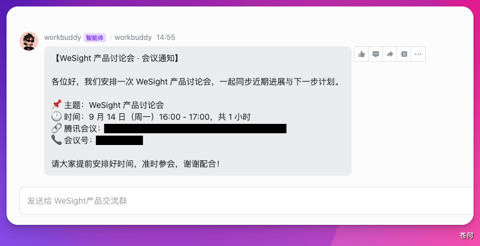

图 8-20 群内会议通知

这个场景把多个工具串了起来：飞书提供办公上下文，腾讯会议负责创建会议，WorkBuddy 协调执行并回传结果。

## 8.7 读取多维表格，生成投放复盘 PPT

做投放复盘时，数据通常在飞书多维表格里，但最终汇报可能需要一份本地 PPT。过去需要导出数据、计算指标、制作图表，再逐页写分析，现在可以把这些步骤放进同一项任务。

```text
读取飞书多维表格【投放数据】里本月的数据，按渠道汇总花费、曝光、点击和转化，计算各渠道 ROI 并找出异常波动（环比变化超过 20% 的），在我的电脑上生成一份复盘 PPT，包含数据图表、异常分析和下月优化建议。
```

计算 ROI（投资回报率）时，需要表格提供相应的收益数据与计算口径；比较环比变化也需要上月数据。缺少这些信息时，应先补齐或明确分析范围。

在本次实践中，WorkBuddy 找到对应的多维表格，读取数据并完成分析，然后给出 4 个 PPT 方案。选定方案后，它继续在电脑上制作完整 PPT，过程见下面的视频。

<video controls playsinline preload="metadata" aria-label="投放数据分析与复盘 PPT 制作演示" src="./assets/campaign-review.mp4"></video>

视频 8-1 投放复盘 PPT 制作过程

## 8.8 读取运营手册，生成 7 天新人学习路径

新人入职后，培训资料往往散落在知识库的不同目录里。负责人需要整理文档，还要安排每天学什么、怎么验收。

```text
下周有一位新运营入职，请读取飞书知识库【运营手册】下的所有文档，按「必读 / 选读 / 工具操作」分类，为她规划一份 7 天学习路径，从 2026-09-14（周一）开始。要求如下。

1. 列出每天的学习主题、文档链接和检验方式；
2. 先学必读，再学工具操作，最后学习选读内容，每天阅读量均衡；
3. 整理成飞书云文档，标题为「新运营 7 天 onboarding 学习路径」，保存到【新人培训】文件夹。
```

执行过程见下面的视频。

<video controls playsinline preload="metadata" aria-label="根据运营手册生成新人学习路径演示" src="./assets/onboarding-plan.mp4"></video>

视频 8-2 新人学习路径生成过程

这条提示词明确了三个要素：读取哪些资料、按照什么规则处理、把结果交付到哪里。这种结构也适用于其他知识整理任务。

## 8.9 做完 GEO 诊断，自动拆成整改任务

我在 WorkBuddy 中发布的「品牌 GEO 可见度诊断师」，可以对品牌完成基建评估、AI 收录检查、竞品对标，并输出 AIVO 评分报告。专家入口如图 8-21 所示。


图 8-21 品牌 GEO 可见度诊断师

以前做完诊断报告，后面还要归档、拆任务、分负责人、建日程、跟进进度。接上飞书后，我直接让 WorkBuddy 把后续工作一起完成。

```text
请调用 GEO 诊断技能，对品牌【WeSight】做一次完整 GEO 可见度诊断，然后做这几件事。

1. 将 AIVO 评分报告保存为飞书云文档「WeSight GEO 诊断报告-202609」，放入【品牌监测】文件夹；
2. 将问题按「内容缺失 / 平台未收录 / 官网基建 / 口碑舆情」分类，逐条写入多维表格【GEO 整改任务】，补充状态、建议负责人、优先级和修改建议；
3. 为高优先级问题创建本周五 17:00 的检查日程；
4. 将总分、3 个最严重的问题和整改任务表链接发到【WeSight产品交流群】；
5. 完成后汇报诊断总分、入表问题数量和日程数。
```

诊断与后续协作的执行过程见下面的视频。

<video controls playsinline preload="metadata" aria-label="GEO 诊断报告同步与整改任务创建演示" src="./assets/geo-workflow.mp4"></video>

视频 8-3 GEO 诊断与整改任务创建过程

执行结束后，WorkBuddy 会把诊断结果同步到飞书，并建立整改任务表。群内结果如图 8-22 所示。

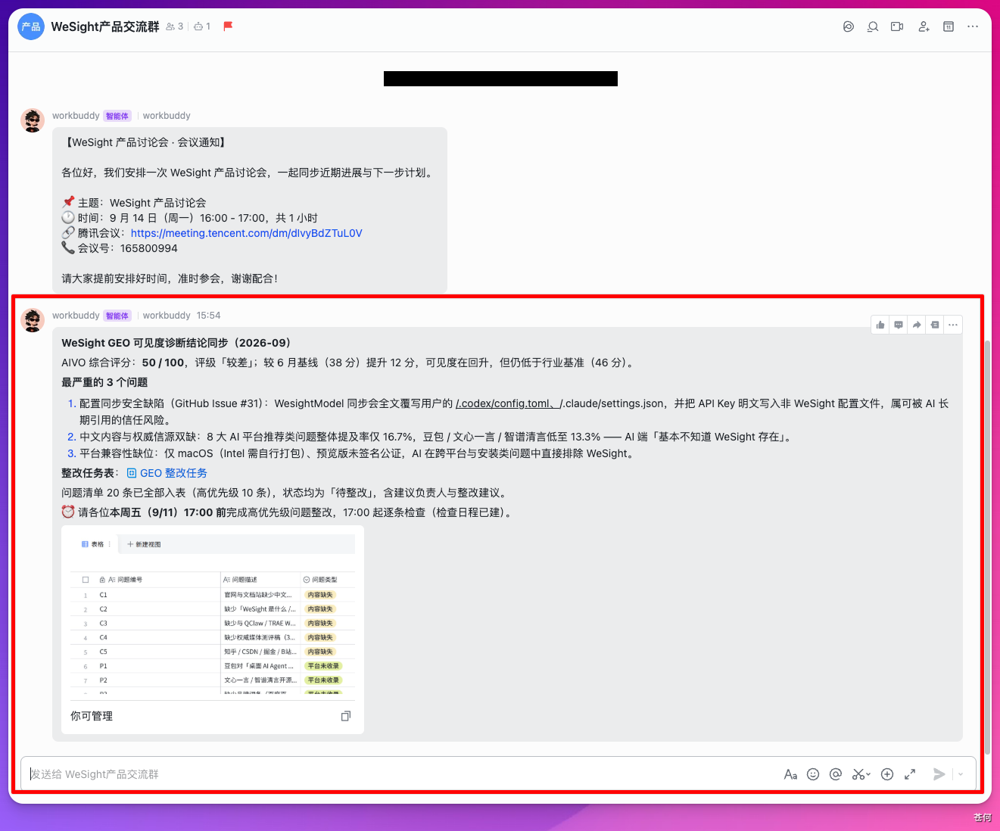

图 8-22 同步 GEO 诊断结果

打开任务表，可以看到任务编号、问题描述、问题类型、状态、建议负责人和修改建议，如图 8-23 所示。

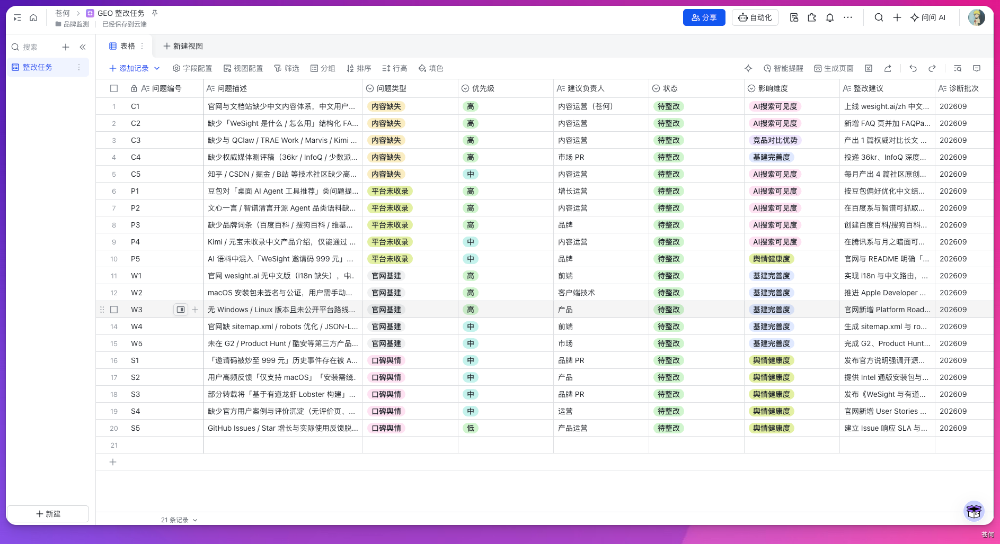

图 8-23 GEO 整改任务表

它还会按照提示词创建检查日程，如图 8-24 所示。

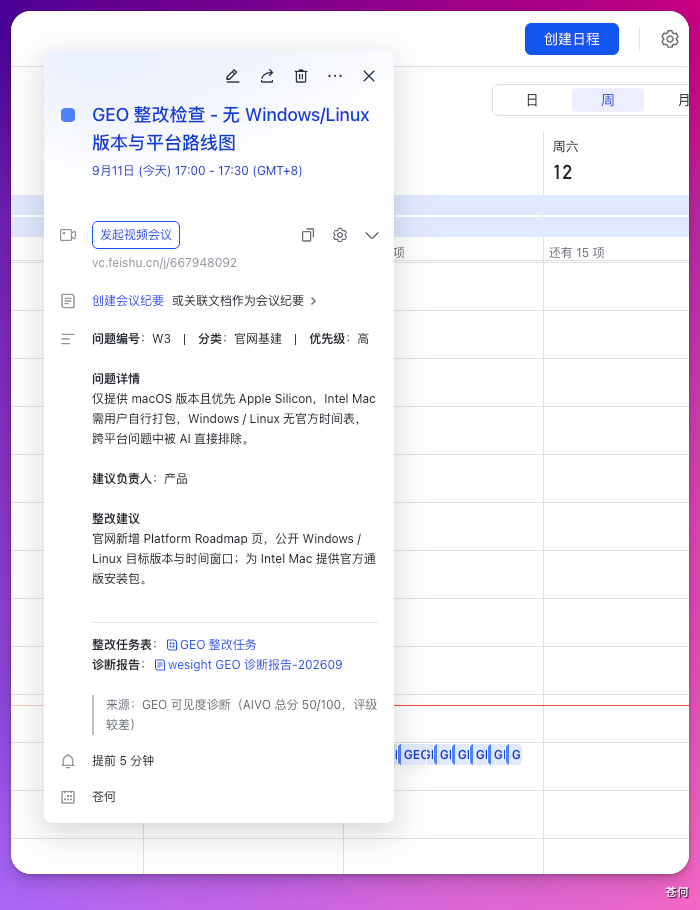

图 8-24 创建整改检查日程

临近时间时，可以收到日历助手的提醒，如图 8-25 所示。

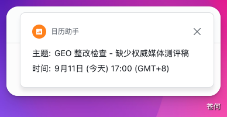

图 8-25 整改检查提醒

## 8.10 抓热点、建选题库，再生成复盘 PPT

做自媒体时，热点发现得太晚，或者看到了却没及时变成选题，都会影响内容安排。我把找热点、写选题库、做复盘、生成 PPT 和同步团队，放进了同一条 WorkBuddy 任务。

```text
完成本周的热点运营工作。

1. 调用抖音实时热点榜技能获取 Top30 热点，结合 AI 工具 / AI 模型行业筛选适合借势的选题；
2. 去重后写入飞书多维表格【选题排期】，补充热度、借势角度、发布形式、时效等级，状态填「待评估」；
3. 读取【内容数据表】本周数据，分析蹭到的热点、还来得及跟的热点，以及本周错过但本该做的 3 个热点；
4. 在电脑上生成「热点周度复盘-第37周」PPT，保存到【周会材料】文件夹；
5. 将复盘核心结论发送到【内容组】，提醒大家在周五会前看完 PPT；
6. 最后汇报新入库数量、PPT 位置和群消息发送结果。
```

复盘过程和最终 PPT 如图 8-26 所示。这个场景需要同时具备热点获取技能、飞书连接器和本地 PPT 制作能力。

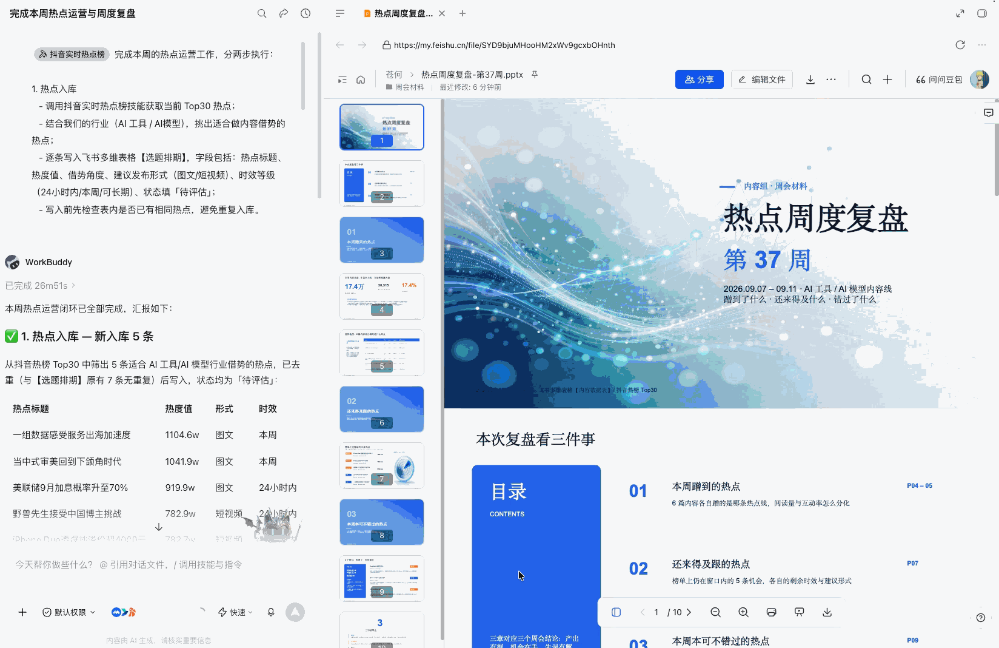

图 8-26 热点周度复盘

WorkBuddy 会把筛选后的热点写进多维表格，并补充借势角度、发布形式和时效等级，如图 8-27 所示。

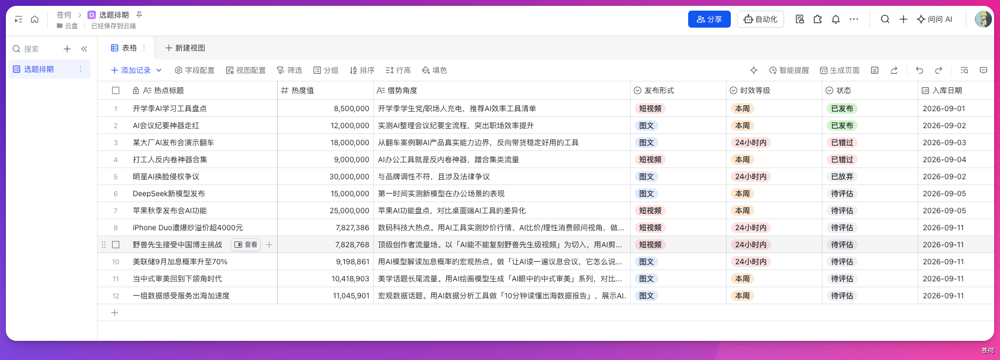

图 8-27 热点选题库

复盘完成后，它还会把核心结论同步到指定群聊，如图 8-28 所示。

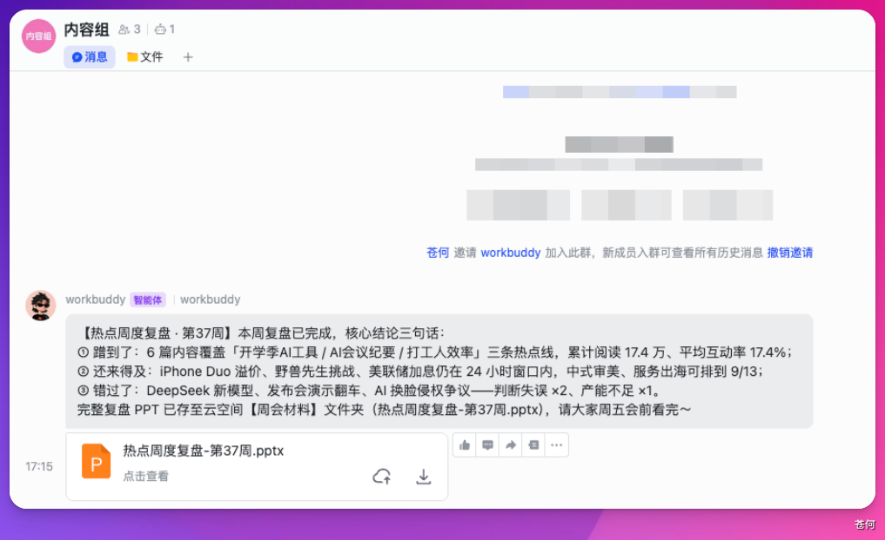

图 8-28 向团队同步复盘结果

## 8.11 把场景用到自己的工作中

这 8 个场景有一个共同的任务结构：读取工作上下文，按明确规则处理，再把结果交付到指定位置。写提示词时，把资料范围、处理规则、交付物和完成后的汇报要求说清楚，就更容易检查执行结果。

可以从一项群聊总结开始，跑通后再加入文档归档、表格记录或群消息同步。涉及腾讯会议、GEO 诊断和热点获取时，先确认对应连接器或技能已经可用。任务结束后，打开实际文档、表格、日程或群消息核对结果，逐步积累自己的可复用工作流程。

本章由苍何的[飞书连接器实践文章](https://my.feishu.cn/wiki/Bi6UwvCkjiKmc8kV5yTcuMrun6g)整理，截图与视频保留原始实践过程。
